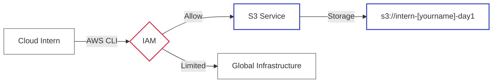

# Lab 01: IAM & AWS CLI Basics

| Difficulty | Est. Time | Prerequisites |
|------------|-----------|---------------|
| Beginner   | 45 Mins   | None          |

## 🎯 Objectives
- Understand the AWS Global Infrastructure (Regions & AZs).
- Learn the basics of Identity and Access Management (IAM).
- Master the AWS CLI for basic resource management.
- Understand the security guardrails of the Pluralsight Sandbox.

---

## 🗺️ Architecture Overview



---

## 📚 Concepts

### 1. AWS Global Infrastructure
AWS is not just "one big data center." It is organized into:
*   **Regions**: Geographic locations (e.g., `us-east-1` in Northern Virginia). Each region is independent. 
*   **Availability Zones (AZs)**: Distinct locations within a region, engineered to be isolated from failures in other AZs. They are connected via low-latency networking.

> [!TIP]
> **Why does this matter?** High availability means deploying your app in *at least two* AZs. If one data center has a power outage, your app stays up in the other.

### 2. IAM (Identity and Access Management)
IAM is the "security guard" of AWS. It follows the **Principle of Least Privilege (PoLP)**—giving only the minimum access needed.

*   **IAM User**: A persistent identity for a specific person or application.
*   **IAM Role**: A temporary identity that can be "assumed." Think of it like a hat you put on to gain temporary powers.
*   **IAM Policy**: A JSON document that defines "Who can do What to Which resource."

---

## 🛠️ Step-by-Step Lab

### Step 1: Verify your Identity
In a professional environment, you should always know *who* you are acting as.

1.  Open the terminal.
2.  Run:
    ```bash
    aws sts get-caller-identity
    ```
3.  **Explanation**: The `sts` (Security Token Service) command returns your ARN (Amazon Resource Name). 
    - If it shows `arn:aws:iam::...:user/cli-user`, you are using the dedicated **CLI User**.
    - If it shows `arn:aws:sts::...:assumed-role/cloud_user/...`, you are using a temporary **Role**.

### Step 2: Explore Regional Differences
AWS CLI commands are regional unless specified otherwise.

1.  List regions to see what's available:
    ```bash
    aws ec2 describe-regions --output table
    ```
2.  **Observation**: Note the `RegionName` and `Endpoint`. Most of our work will be in `us-east-1`.

### Step 3: Create a Unique S3 Bucket
S3 is a global namespace. Bucket names must be unique across the entire world!

1.  Run the following command (replace `[yourname]` with your name):
    ```bash
    aws s3 mb s3://intern-[yourname]-day1 --region us-east-1
    ```
2.  **Pro-Tip**: Use a prefix like `intern-` and include the date or your name to avoid "Bucket Already Exists" errors.

### Step 4: Upload and Manage Files
1.  Create a local file:
    ```bash
    echo "This is my first cloud file!" > test.txt
    ```
2.  Upload it to your bucket:
    ```bash
    aws s3 cp test.txt s3://intern-[yourname]-day1/
    ```
3.  Check object metadata:
    ```bash
    aws s3api head-object --bucket intern-[yourname]-day1 --key test.txt
    ```

---

## ❓ Troubleshooting & Pitfalls

- **"Access Denied"**: In the Pluralsight sandbox, you are restricted from many actions (like creating IAM users or deleting certain logs). This is normal!
- **"BucketAlreadyExists"**: Someone else in the world already took that name. Add more random numbers or your full name to the bucket name.
- **Regions**: If you create a bucket in `us-west-2` but try to list it without specifying the region, you might get errors depending on your local config.

---

## 🧠 Lab Tasks: The Profile Detective
**Goal**: Manage multiple identities and audit permissions boundaries.

1.  **Configure a second profile**: Run `aws configure --profile investigator`. Enter dummy values for keys (e.g., `AKIA123...`).
2.  **Verify failure**: Run `aws sts get-caller-identity --profile investigator`. Explain why it fails and what "InvalidClientTokenId" means.
3.  **Identity Audit**: Using your **primary** profile, identify the name of the IAM Role or User you are currently using. Use `aws iam list-attached-user-policies` or `list-attached-role-policies` to find which policy allows S3 access.

---

## 🧹 Cleanup
To avoid costs (and practice good hygiene), delete your resources:
```bash
aws s3 rb s3://intern-[yourname]-day1 --force
```
*(The `--force` flag deletes all objects inside before removing the bucket).*
