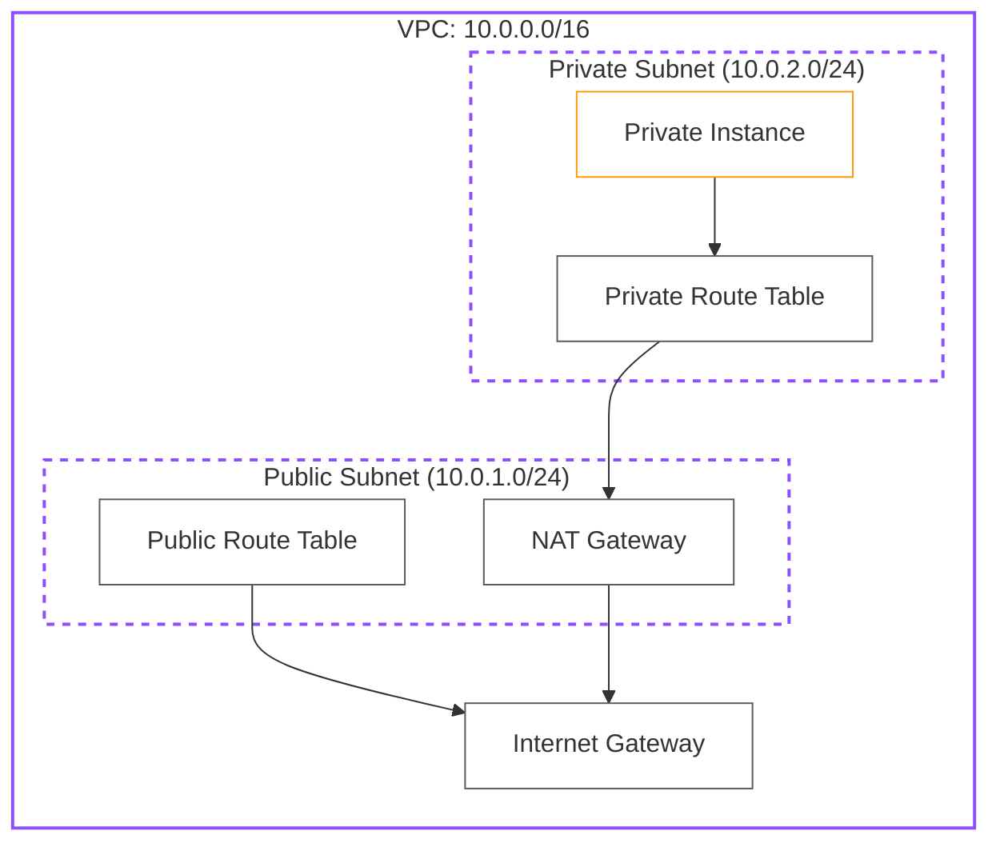

# Lab 02: VPC & Networking Basics

| Difficulty | Est. Time | Prerequisites |
|------------|-----------|---------------|
| Intermediate| 75 Mins   | Lab 01        |

## 🎯 Objectives
- Build a custom VPC from scratch in the Northern Virginia region (`us-east-1`).
- Configure Public and Private subnets to understand traffic flow.
- Master the relationship between Internet Gateways (IGW) and NAT Gateways.
- Deploy a **NAT Gateway** to allow private instances to access the internet.
- Explicitly manage **Public** and **Private Route Tables**.

---

## 🗺️ Architecture Overview

---

## 📚 Concepts

### 1. The VPC (Virtual Private Cloud)
Think of a VPC as your own isolated slice of the AWS cloud. 
*   **CIDR Block**: The range of IP addresses (e.g., `10.0.0.0/16`). 
*   **Subnets**: Smaller chunks of the VPC CIDR for resource grouping.

### 2. The Gateways (IGW vs NAT)
- **Internet Gateway (IGW)**: A two-way door. Allows traffic from the internet TO your VPC and vice versa. Required for "Public" subnets.
- **NAT Gateway (Network Address Translation)**: A one-way door. Allows instances in a **Private Subnet** to talk to the internet (e.g., for software updates) but stops the internet from talking TO the instances. 
    - *Note: NAT Gateways reside in a Public Subnet and require an Elastic IP.*

### 3. Route Tables: The Traffic Signs
Route tables tell packets where to go. 
- **Public Route Table**: Points `0.0.0.0/0` (all internet traffic) to the **IGW**.
- **Private Route Table**: Points `0.0.0.0/0` to the **NAT Gateway**.

---

## 🛠️ Step-by-Step Lab (AWS Console)

### Step 1: Create the VPC
1.  Navigate to the **VPC Dashboard**.
2.  Click **Create VPC** (Choose "VPC only").
3.  **Name**: `Intern-VPC`, **CIDR**: `10.0.0.0/16`.

### Step 2: Create Subnets
1.  **Public Subnet**: Name `Public-Subnet`, AZ `us-east-1a`, CIDR `10.0.1.0/24`.
2.  **Private Subnet**: Name `Private-Subnet`, AZ `us-east-1a`, CIDR `10.0.2.0/24`.

### Step 3: Create the Internet Gateway (IGW)
1.  Create `Intern-IGW` and **Attach to VPC** (`Intern-VPC`).

### Step 4: Create the NAT Gateway
1.  Go to **NAT Gateways** > **Create NAT gateway**.
2.  **Subnet**: Select `Public-Subnet` (Crucial!).
3.  **Connectivity type**: Public.
4.  **Elastic IP**: Click "Allocate Elastic IP".
5.  Click **Create NAT gateway**.

### Step 5: Configure Routing (The Key Step)
1.  **Public Route Table**:
    - Create `Public-RT`. Associate with `Public-Subnet`.
    - **Edit Routes**: Add `0.0.0.0/0` -> Target: `Internet Gateway`.
2.  **Private Route Table**:
    - Create `Private-RT`. Associate with `Private-Subnet`.
    - **Edit Routes**: Add `0.0.0.0/0` -> Target: `NAT Gateway` -> `Intern-NAT`.

---

## ❓ Troubleshooting & Pitfalls

- **NAT Gateway Cost**: In a real account, NAT Gateways cost money per hour. Always delete them when finished!
- **NAT in Private Subnet**: If you put a NAT Gateway in a private subnet, it cannot reach the internet to do its job. It MUST be in a Public Subnet.
- **Missing EIP**: Public NAT Gateways require a static Elastic IP (EIP) to function.

---

## 🧠 Lab Tasks: The Traffic Controller
**Goal**: Isolate resources and bypass NAT via VPC Endpoints.

1.  **Introduce Isolation**: Navigate to the **Private Route Table** and remove the `0.0.0.0/0` (NAT Gateway) route.
2.  **Verify Blackout**: From your private instance, verify that `ping 8.8.8.8` and `aws s3 ls` both fail/timeout.
3.  **Restore Access (Private Path)**: Provision an **S3 Gateway Endpoint** for your VPC and associate it with the `Private-RT`.
4.  **Verification**: Run `aws s3 ls` again. Explain why this works while `ping 8.8.8.8` still fails.

---

## 🧹 Cleanup
1. Delete the NAT Gateway (and release the Elastic IP!).
2. Delete the VPC (handling IGW, subnets, and RTs).
