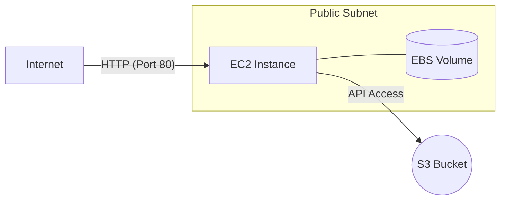

# Lab 03: EC2 & S3 Storage

| Difficulty | Est. Time | Prerequisites |
|------------|-----------|---------------|
| Intermediate| 60 Mins   | Lab 02        |

## 🎯 Objectives
- Launch and configure an Amazon EC2 instance.
- Automate server setup using **User Data**.
- Understand physical block storage (**EBS**) and its persistence.
- Store and retrieve files from Object Storage (**S3**).

---

## 🗺️ Architecture Overview



---

## 📚 Concepts

### 1. EC2: The CPU & RAM
EC2 (Elastic Compute Cloud) provides virtual servers. 
- **AMI (Amazon Machine Image)**: The "Gold Image" or template (OS + Software) for your server.
- **Instance Types**: `t3.micro` is part of the "Burstable" family, suitable for low-intensity workloads.

### 2. User Data: Your First Automation
When an EC2 instance starts for the *first time*, it can run a shell script. This is called **bootstrapping**. It allows you to install web servers or config files automatically.

### 3. EBS vs S3 (The "Where do I put it?" guide)
| Feature | EBS (Elastic Block Store) | S3 (Simple Storage Service) |
|---------|---------------------------|-----------------------------|
| **Format** | Block Storage (HDD/SSD) | Object Storage (API-based) |
| **Typical Use**| OS Drives, Databases | Media, Backups, Static Sites |
| **Scope** | Regional (tied to an AZ) | Global (accessible via URL) |
| **Speed** | Ultra-low latency | High throughput, higher latency |

---

## 🛠️ Step-by-Step Lab

### Step 1: Launch a Self-Configuring Web Server
1.  Navigate to **EC2** > **Instances** > **Launch Instance**.
2.  **Name**: `My-Web-Server`
3.  **AMI**: Amazon Linux 2023.
4.  **Network Settings**: 
    - VPC: `Intern-VPC`.
    - Subnet: `Public-Subnet`.
    - Auto-assign Public IP: **Enable**.
5.  **Security Group**: Create a new one named `Web-SG`. Allow **HTTP (Port 80)** from `0.0.0.0/0`.
6.  **Advanced Details**: Scroll to the bottom to **User Data** and paste:
    ```bash
    #!/bin/bash
    dnf update -y
    dnf install -y httpd
    systemctl start httpd
    systemctl enable httpd
    # Get instance ID from metadata service (IMDSv2)
    TOKEN=`curl -X PUT "http://169.254.169.254/latest/api/token" -H "X-aws-ec2-metadata-token-ttl-seconds: 21600"`
    ID=`curl -H "X-aws-ec2-metadata-token: $TOKEN" http://169.254.169.254/latest/meta-data/instance-id`
    echo "<h1>Welcome to the Intern Web Server!</h1><p>Instance ID: $ID</p>" > /var/www/html/index.html
    ```

### Step 2: Verify the Web Server
1.  Wait for the status to show "Running."
2.  Paste the **Public IPv4 address** into your browser. 
3.  **Explanation**: If you see your Instance ID, the bootstrapping via UserData was successful!

### Step 3: Add a Second "Hard Drive" (EBS)
1.  Go to **Volumes** > **Create Volume**. 10 GiB, same AZ as your instance.
2.  Select volume > **Actions** > **Attach Volume**.
3.  Login via **SSM Session Manager** or **EC2 Instance Connect** and run:
    ```bash
    lsblk # Confirm disk existence
    sudo mkfs -t xfs /dev/xvdf # Format
    sudo mkdir /data           # Mount point
    sudo mount /dev/xvdf /data # Attach
    echo "Stateful data" | sudo tee /data/notes.txt
    ```

---

## ❓ Troubleshooting & Pitfalls

- **User Data Failed**: Check logs on the instance at `/var/log/cloud-init-output.log`.
- **IMDSv2**: Modern AMI's require a "Token" to access instance metadata (the `curl -X PUT` command in UserData).
- **AZ Mismatch**: You cannot attach an EBS volume in `us-east-1a` to an instance in `us-east-1b`.

---

## 🔥 BONUS CHALLENGE: The Data Survivor
**Scenario**: You accidentally delete your server. Can you save the data?
1.  Set the volume setting "Delete on Termination" to **False**.
2.  Terminate the instance.
3.  **Goal**: Launch a *new* instance and attach this volume. Re-mount it. Is `notes.txt` still there?

---

## 🧹 Cleanup
- Terminate EC2 instances.
- Delete the 10GB EBS volume.
- (Optional) Use `aws s3 rb` if you created buckets.
