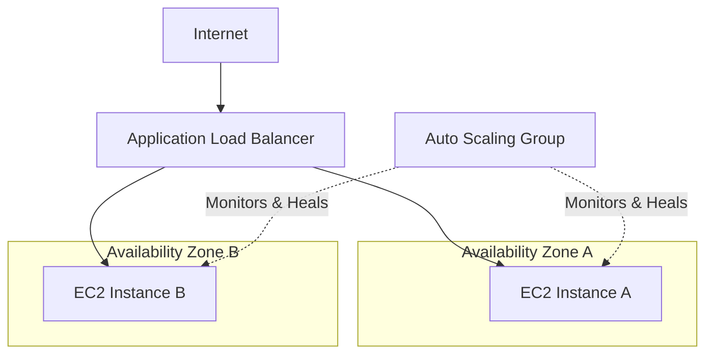

# Lab 04: Load Balancers & Scaling

| Difficulty | Est. Time | Prerequisites |
|------------|-----------|---------------|
| Intermediate| 75 Mins   | Lab 03        |

## 🎯 Objectives
- Build an "indestructible" web application.
- Understand how **Load Balancers** distribute traffic across Availability Zones.
- Use **Auto Scaling Groups** to automatically replace failed servers.
- Perform a "Rolling Update" with zero downtime.

---

## 🗺️ Architecture Overview



---

## 📚 Concepts

### 1. High Availability (HA)
In the cloud, "Everything fails all the time." HA means your system is designed to survive the failure of individual components (like an EC2 instance) or even an entire AZ.

### 2. Application Load Balancer (ALB)
The ALB is the Traffic Controller. It provides a single stable DNS name (e.g., `my-app.aws.com`) and routes requests to a "Target Group" of servers based on health and availability.

### 3. Auto Scaling Group (ASG)
The ASG is the Manager. It ensures that the **Desired Capacity** of instances is always running. If an instance fails a health check or is manually terminated, the ASG launches a replacement.

---

## 🛠️ Step-by-Step Lab

### Step 1: Design the "Launch Template"
Instead of a manual launch, we create a template (blueprint).
1.  Navigate to **EC2** > **Launch Templates** > **Create launch template**.
2.  **Name**: `Web-App-Template`. AMI: Amazon Linux 2023. Instance Type: `t3.micro`.
3.  **Security Group**: Select `Web-SG`.
4.  **User Data**:
    ```bash
    #!/bin/bash
    dnf install -y httpd
    systemctl start httpd
    systemctl enable httpd
    echo "<h1>Site is UP!</h1><p>Served by: $(hostname -f)</p>" > /var/www/html/index.html
    ```

### Step 2: Create the "Target Group"
1.  Go to **Target Groups** > **Create target group**.
2.  **Target type**: Instances. Name: `Web-TG`. VPC: `Intern-VPC`.
3.  **Health Checks**: Path: `/`, Success codes: `200`.

### Step 3: Create the Load Balancer (ALB)
1.  Go to **Load Balancers** > **Create ALB**.
2.  **Network Mapping**: Select `Intern-VPC` and select **TWO** public subnets (one in `1a`, one in `1b`).
3.  **Listeners**: Protocol HTTP, Port 80. Action: Forward to `Web-TG`.

### Step 4: Create the Auto Scaling Group (ASG)
1.  Go to **Auto Scaling Groups** > **Create ASG**.
2.  **Network**: Select your two public subnets.
3.  **Load Balancing**: Attach to an existing target group -> `Web-TG`.
4.  **Health Checks**: Select "ELB" (Elastic Load Balancing) health checks.
5.  **Group Size**: Desired: `2`, Min: `1`, Max: `3`.

---

## 📝 Verification: The "Chaos Monkey" Test
1.  **Load Balancing**: Copy the **ALB DNS Name** and paste it into a browser. Refresh repeatedly. The hostname should swap between your two instances.
2.  **Self-Healing**: 
    - Go to **EC2 Instances** and **Terminate** one of the ASG-created instances.
    - Go to **ASG > Activity History**. You will see "Terminating an instance" followed by "Launching a new instance."
    - **Result**: The app stays up via the other instance while the new one bootstraps!

---

## ❓ Troubleshooting & Pitfalls

- **Instances "Unhealthy" in TG**: Check the Security Group! The ALB must be allowed to talk to the instances on Port 80.
- **ASG Not Launching**: Check the **Launch Template**. If the AMI or Instance Type is invalid for the account, the ASG will repeatedly fail to launch.
- **ALB Deployment Time**: It can take 2-5 minutes for an ALB to fully initialize and for health checks to pass. Be patient!

---

## 🔥 BONUS CHALLENGE: The Rolling Update
**Scenario**: You need to update the website text without any downtime.
1.  Create **Version 2** of the Launch Template with new UserData text.
2.  Run an **Instance Refresh** on the ASG.
3.  **Observation**: Watch how ASG stops one "old" instance and starts one "new" instance, ensuring at least one server is always active.

---

## 🧹 Cleanup
- Delete the ASG (this handles termination).
- Delete the ALB.
- Delete the Target Group and Launch Template.
