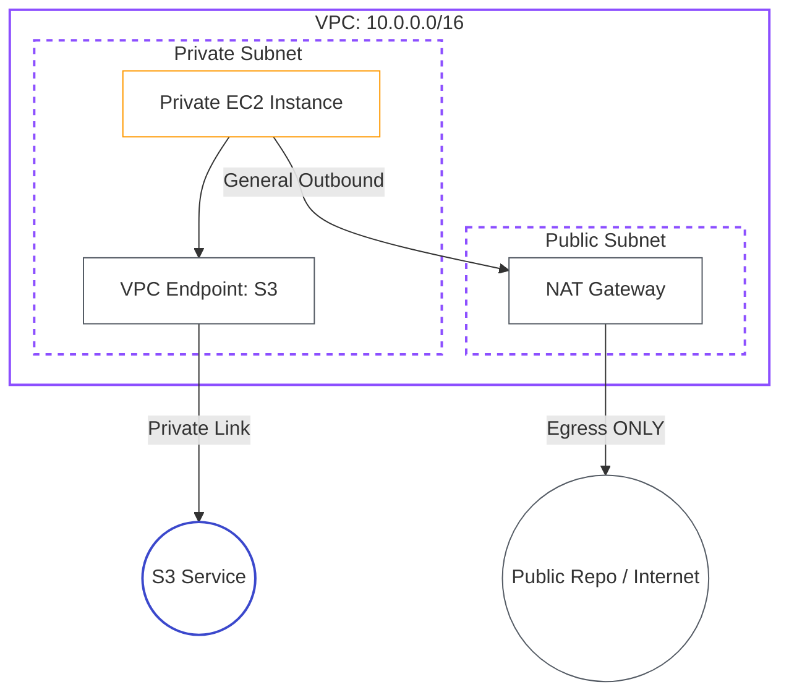

# Lab 05: Secure Networking (NACLs/SGs)

| Difficulty | Est. Time | Prerequisites |
|------------|-----------|---------------|
| Advanced   | 75 Mins   | Lab 02, Lab 03|

## 🎯 Objectives
- Access AWS services (like S3) from a private subnet without a direct internet connection.
- Use **Systems Manager (SSM)** to securely manage instances without SSH keys.
- **Compare** NAT Gateway vs VPC Endpoints for private connectivity.
- Understand the difference between Gateway and Interface VPC Endpoints.

---

## 🗺️ Architecture Overview



---

## 📚 Concepts

### 1. Private Connectivity Options
How does a private instance reach external services?
- **NAT Gateway**: General-purpose. Allows access to the entire internet (updates, APIs, repos). Traffic goes through the public internet space.
- **VPC Endpoint**: Service-specific. Creates a private link to AWS services (S3, SSM, etc.). Traffic **NEVER** leaves the AWS backbone network.

### 2. Comparison: NAT vs VPC Endpoints
| Feature | NAT Gateway | VPC Endpoints |
|---------|-------------|---------------|
| **Scope** | Global (Full Internet) | Specific AWS Service |
| **Security**| Good (Egress only) | Best (Private AWS backbone) |
| **Cost** | Fixed Hourly + Data | Interface: Paid / Gateway: Free |
| **Setup** | Requires Public Subnet | No Public Subnet needed |

---

## 🛠️ Step-by-Step Lab

### Step 1: Verify Initial Connectivity (via NAT)
1.  Ensure you have a `t3.micro` instance in your **Private-Subnet** from Lab 03.
2.  Connect via **SSM Session Manager**.
3.  Test internet access (via the NAT Gateway created in Lab 02):
    ```bash
    ping -c 3 google.com
    aws s3 ls
    ```
    *Observation: Both commands should work because of the NAT Gateway route.*

### Step 2: Simulate Isolation (The "Blackout")
1.  Go to **VPC** > **Route Tables** > Select `Private-RT`.
2.  **Edit Routes**: Remove the route `0.0.0.0/0` -> `nat-xxxx`.
3.  Go back to your SSM terminal and try the commands again:
    ```bash
    ping -c 3 google.com
    aws s3 ls
    ```
    *Observation: Both will hang/fail. Your instance is now truly isolated.*

### Step 3: Provision an S3 Gateway Endpoint
1.  Go to **VPC** > **Endpoints** > **Create endpoint**.
2.  **Service Name**: Search for `s3` and select the one with Type **Gateway**.
3.  **VPC**: Select `Intern-VPC`.
4.  **Route Tables**: Check the box for `Private-RT`. This automatically injects the route!
5.  Click **Create endpoint**.

### Step 4: Verify Selective Private Access
1.  Return to your SSM terminal.
2.  Test general internet access:
    ```bash
    ping -c 3 google.com
    ```
    *Observation: Still fails. There is no route to the internet.*
3.  Test S3 access:
    ```bash
    aws s3 ls
    ```
    *Observation: **SUCCESS!** You are talking to S3 over a private AWS tunnel, bypasses the public internet.*

---

## ❓ Troubleshooting & Pitfalls

- **DNS Hostnames**: Interface Endpoints require "Enable DNS Hostnames" in the VPC settings. Gateway Endpoints do not.
- **SSM Disconnects**: If you remove the NAT Gateway route and don't have SSM Interface Endpoints, your Session Manager might disconnect. If this happens, re-add the NAT route temporarily.
- **Route Table Association**: If the endpoint isn't working, check if you selected the *correct* route table during creation.

---

## 🧠 Lab Tasks: The Zero-Egress Fortress
**Goal**: Securely manage instances without any internet path.

1.  **Cut the Cord**: Remove the `0.0.0.0/0` route from your `Private-RT`. Verify that `ping google.com` and `aws s3 ls` fail from your private instance.
2.  **SSM over Private Link**: Setup Interface VPC Endpoints for `ssm` and `ssmmessages` in the `Private-Subnet`.
3.  **Restore Management**: Verify that you can still connect to the instance via **SSM Session Manager** even though it has zero internet access.
4.  **S3 Backbone Access**: Re-attach the S3 Gateway Endpoint. Prove that `aws s3 ls` works while `ping google.com` still fails. Document why this is more secure.

---

## 🧹 Cleanup
1. Delete the VPC Endpoint (VPC > Endpoints).
2. Restore the `Private-RT` routes if needed for next labs.
3. Terminate the private instance.
