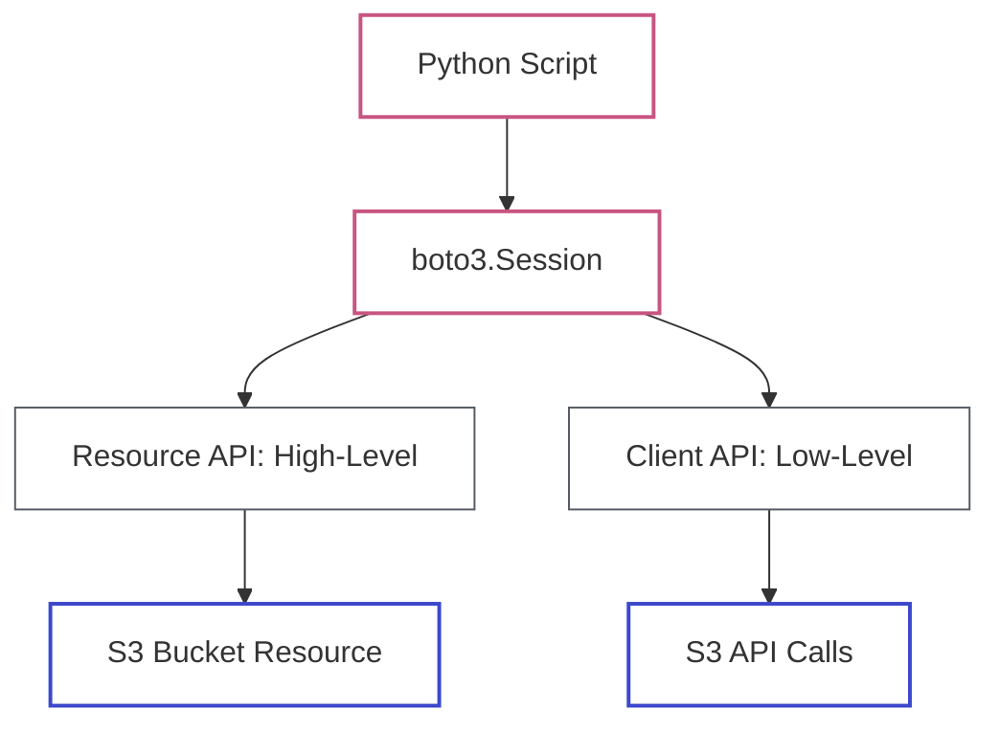

# Lab 06: Python for AWS (Boto3)

| Difficulty | Est. Time | Prerequisites |
|------------|-----------|---------------|
| Beginner   | 45 Mins   | Python Basics |

## 🎯 Objectives
- Install and configure the AWS SDK for Python (**Boto3**).
- Understand the difference between **Resources** and **Clients**.
- Programmatically manage S3 buckets and objects.

---

## 🗺️ Boto3 Architecture



---

## 📚 Concepts

### 1. What is Boto3?
Boto3 is the official AWS SDK for Python. It allows you to write scripts that manage AWS services directly.

### 2. Client vs. Resource
*   **Client**: Low-level service access. Map 1:1 with the AWS service APIs (e.g., `s3.list_buckets()`). Returns nested dictionaries.
*   **Resource**: High-level, object-oriented API. Better for most tasks (e.g., `s3.Bucket('my-bucket').objects.all()`).

### 3. The Session Object
A session stores configuration state and allows you to create service clients and resources. By default, Boto3 uses the credentials configured in your `~/.aws/credentials` file.

### 4. Credentials Resolution Order
Boto3 looks for credentials in a specific order:
1.  **Parameters** passed to the `Session` object.
2.  **Environment Variables** (e.g., `AWS_ACCESS_KEY_ID`).
3.  **Shared Credential File** (`~/.aws/credentials`).
4.  **IAM Role** for EC2 (if running on an AWS instance).

### 5. Error Handling
When a call fails, Boto3 raises a `ClientError`. This exception contains an `Error` dictionary with a `Code` (e.g., `NoSuchBucket`) and a `Message`.

### 6. Waiters & Paginators
- **Waiters**: Built-in polling mechanisms that wait for a resource to reach a specific state (e.g., `instance_running`).
- **Paginators**: Handlers for service responses that are too large to fit in a single API call (e.g., listing 10,000 S3 objects).

---

## 🛠️ Step-by-Step Lab

### Step 1: Environment Setup
1.  Verify Python is installed:
    ```bash
    python3 --version
    ```
2.  Install Boto3:
    ```bash
    pip install boto3
    ```

### Step 2: Your First Script (Client API)
Create a file named `list_buckets.py`:
```python
import boto3

# Create an S3 client
s3 = boto3.client('s3')

# List buckets
response = s3.list_buckets()

print("Existing buckets:")
for bucket in response['Buckets']:
    print(f"  {bucket['Name']}")
```
Run it: `python3 list_buckets.py`

### Step 3: Managing Objects (Resource API)
Create a file named `manage_s3.py`:
```python
import boto3

# Create an S3 resource
s3 = boto3.resource('s3')

# 1. Create a bucket (Note: must be globally unique!)
bucket_name = "intern-boto3-lab-" + input("Enter your name: ").lower()
bucket = s3.create_bucket(Bucket=bucket_name)
print(f"Created bucket: {bucket_name}")

# 2. Upload a file
with open("hello.txt", "w") as f:
    f.write("Hello from Boto3!")

bucket.upload_file("hello.txt", "hello-boto3.txt")
print("Uploaded hello.txt")

# 3. List objects
print(f"Objects in {bucket_name}:")
for obj in bucket.objects.all():
    print(f"  {obj.key}")
```
Run it: `python3 manage_s3.py`

---

## ❓ Troubleshooting & Pitfalls

- **"No credentials found"**: Run `aws configure` to set your keys.
- **Botocore errors**: Boto3 is built on top of Botocore. Most exceptions you'll see are actually from Botocore.
- **Region issues**: If you don't specify a region, Boto3 uses the one in your config. Bucket creation in `us-east-1` has special rules (no `LocationConstraint`).

---

## 🧠 Lab Tasks: The S3 Content Manager
**Goal**: Programmatic bucket and object management.

1.  **The Multi-Upload Script**: Write a Boto3 script that creates a bucket and uploads 3 different text files in a single run.
2.  **Tagging Service**: Modify the script to add a tag `Project: Intern-Labs` to *only* one of the three files during upload.
3.  **The Audit**: Add a function to the script that lists all objects in the bucket, their size in bytes, and prints the tags for the file you tagged in Step 2.
4.  **Automatic Cleanup**: Add a `cleanup()` function to the script that deletes all objects and the bucket after a successful audit. Document why bucket deletion fails if it's not empty.

---

## 🧹 Cleanup
Update `manage_s3.py` or create a new script to delete the bucket and its objects:
```python
# To delete a bucket, it MUST be empty
bucket.objects.all().delete()
bucket.delete()
```
