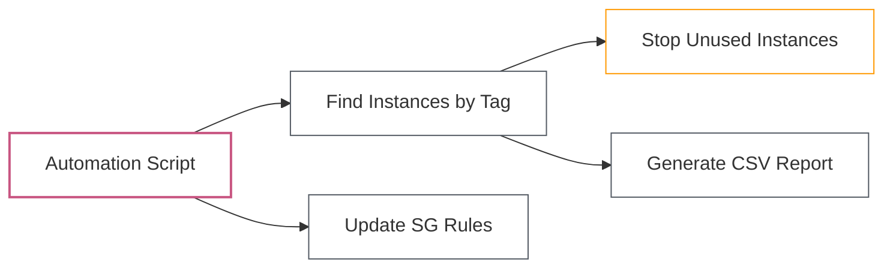

# Lab 07: Automating AWS with Boto3

| Difficulty | Est. Time | Prerequisites |
|------------|-----------|---------------|
| Intermediate | 60 Mins | Lab 06 Completion |

## 🎯 Objectives
- Automate EC2 instance lifecycle management.
- Dynamic infrastructure discovery based on tags.
- Programmatic Security Group management.

---

## 🗺️ Automation Flow



---

## 📚 Concepts

### 1. Waiters
Sometimes you need to wait for a resource to reach a certain state (e.g., waiting for an EC2 instance to be `running`). Boto3 provides **Waiters** to handle this efficiently without writing manual loops.

### 2. Paginators
Service responses are often truncated (e.g., if you have 10,000 S3 objects). **Paginators** allow you to iterate through all results seamlessly.

### 3. Collections
In the Resource API, **Collections** provide an iterable interface to groups of resources (e.g., `ec2.instances.all()`).

---

## 🛠️ Step-by-Step Lab

### Step 1: Launch an EC2 Instance with Tags
Create `launch_instance.py`:
```python
import boto3

ec2 = boto3.resource('ec2', region_name='us-east-1')

# Launch instance
instances = ec2.create_instances(
    ImageId='ami-0c55b159cbfafe1f0', # Amazon Linux 2 (Verify in us-east-1!)
    MinCount=1,
    MaxCount=1,
    InstanceType='t3.micro',
    TagSpecifications=[
        {
            'ResourceType': 'instance',
            'Tags': [
                {'Key': 'Name', 'Value': 'Boto3-Automation-Lab'},
                {'Key': 'Environment', 'Value': 'Dev'}
            ]
        }
    ]
)

print(f"Launching instance: {instances[0].id}")

# Wait until running
instances[0].wait_until_running()
print("Instance is now running!")
```

### Step 2: Discover and Stop Instances
Create `stop_dev_instances.py`:
```python
import boto3

ec2 = boto3.resource('ec2')

# Filter for instances with Environment: Dev
dev_instances = ec2.instances.filter(
    Filters=[
        {'Name': 'tag:Environment', 'Value': 'Dev'},
        {'Name': 'instance-state-name', 'Value': 'running'}
    ]
)

for instance in dev_instances:
    print(f"Stopping instance {instance.id}...")
    instance.stop()
```

### Step 3: Security Group Auditor
Create `audit_sg.py`:
```python
import boto3

ec2 = boto3.client('ec2')

# Get all security groups
sgs = ec2.describe_security_groups()['SecurityGroups']

for sg in sgs:
    print(f"Auditing SG: {sg['GroupName']} ({sg['GroupId']})")
    for rule in sg['IpPermissions']:
        for ip_range in rule.get('IpRanges', []):
            if ip_range.get('CidrIp') == '0.0.0.0/0':
                print(f"  [WARNING] Open to world on port: {rule.get('FromPort')}")
```

---

## ❓ Troubleshooting & Pitfalls

- **WaitUntilRunning**: If the instance fails to launch (e.g., lack of capacity), this might time out. 
- **Filters**: Tags are case-sensitive. `Environment` is not the same as `environment`.
- **DryRun**: Most EC2 methods support a `DryRun=True` flag. Use it to test permissions before actually making changes!

---

## 🧠 Lab Tasks: The Infrastructure Janitor
**Goal**: Create and then programmatically remediate a security risk.

1.  **Create the Risk**: Write a Boto3 script that creates a new Security Group named `Legacy-SG` with Port 22 open to `0.0.0.0/0` (The World).
2.  **The Auditor**: Add a function that searches for any Security Group with an "All Open" SSH rule and tags it `Status: Non-Compliant`.
3.  **The Remediation**: Add a function to the script that automatically deletes the world-open rule and replaces it with a rule allowing only your current public IP address.
4.  **Verification**: List the Security Group rules before and after the script runs to prove the remediation was successful.

---

## 🧹 Cleanup
Delete the instance you created:
```python
instance.terminate()
```
*(Optionally delete the snapshots created in the bonus challenge).*
