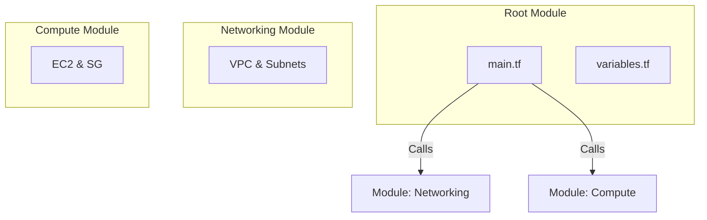

# Lab 09: Reusable Terraform Modules

| Difficulty | Est. Time | Prerequisites |
|------------|-----------|---------------|
| Advanced   | 90 Mins   | Lab 06        |

## 🎯 Objectives
- Organize Terraform code into reusable **Modules**.
- Master **Meta-Arguments**: `count` and `for_each`.
- Handle complex data types (lists, maps) in **Variables** and **Outputs**.
- Understand module scope and logical isolation.

---

## 🗺️ Modular Architecture



---

## 📚 Concepts

### 1. Modules: The Building Blocks
A module is a container for multiple resources that are used together. 
- **Root Module**: The directory where you run `terraform apply`.
- **Child Module**: A separate folder called by the root module.
- **Benefits**: Reusability, testing, and organization.

### 2. Meta-Arguments: Logic in HCL
- **`count`**: Good for creating multiple identical resources based on a number.
- **`for_each`**: Best for creating resources based on a **Map** or **Set of Strings**. It allows you to use keys (e.g., "web-server", "db-server") instead of indices (0, 1, 2).

### 3. Variable Validation
You can now add custom rules to variables to catch errors before they reach AWS:
```hcl
variable "instance_type" {
  type = string
  validation {
    condition     = contains(["t3.micro", "t3.small"], var.instance_type)
    error_message = "Only free-tier-ish instances allowed!"
  }
}
```

---

## 🛠️ Step-by-Step Lab

### Step 1: Create a Networking Module
1.  Create a folder `modules/networking`.
2.  Define a VPC and a Subnet in `modules/networking/main.tf`.
3.  **Crucial**: Use `output "vpc_id"` so the root module can see it.

### Step 2: Use `count` for Subnets
In your networking module:
```hcl
resource "aws_subnet" "public" {
  count             = 2
  vpc_id            = aws_vpc.main.id
  cidr_block        = "10.0.${count.index}.0/24"
  availability_zone = "us-east-1a"
}
```

### Step 3: Use `for_each` for Security Groups
In a new `modules/security` folder:
```hcl
variable "ingress_rules" {
  type = map(number)
  default = {
    "http"  = 80
    "https" = 443
    "ssh"   = 22
  }
}

resource "aws_security_group_rule" "ingress" {
  for_each          = var.ingress_rules
  type              = "ingress"
  from_port         = each.value
  to_port           = each.value
  protocol          = "tcp"
  security_group_id = aws_security_group.allow_all.id
  cidr_blocks       = ["0.0.0.0/0"]
}
```

### Step 4: The Root Module
In your main `main.tf` (root), call your modules:
```hcl
module "vpc" {
  source = "./modules/networking"
}

module "sg" {
  source = "./modules/security"
  vpc_id = module.vpc.vpc_id
}
```

---

## ❓ Troubleshooting & Pitfalls

- **Dependency Cycle**: If Module A needs an output from B, and B needs one from A, Terraform will error. Keep your dependencies linear.
- **Count vs For_Each**: If you use `count` and delete index `1`, index `2` might be destroyed and recreated as the new index `1`. Always use `for_each` for resources that are unique and shouldn't be shifted.
- **Module Versioning**: In real life, point to Git URLs or a Registry, not just local folders.

---

## 🔥 BONUS CHALLENGE: The Dynamic Subnetter
**Scenario**: You need subnets in every AZ.
1.  Use the `data "aws_availability_zones" "available" {}` data source.
2.  Use `for_each` or `count` to create one subnet per available AZ automatically.
3.  **Goal**: Prove that your code adapts if you change regions (e.g., from `us-east-1` to `us-west-2`).

---

## 🧹 Cleanup
`terraform destroy`
nd to local by removing the `backend` block and running `terraform init -migrate-state`.
- Run `terraform destroy`.
- Manually delete the S3 bucket and DynamoDB table.
