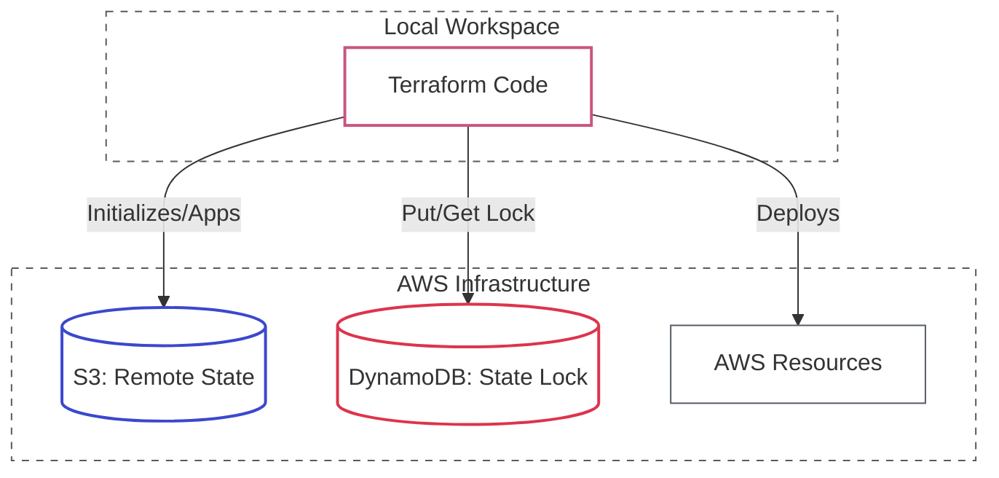

# Lab 10: Terraform State & Import

| Difficulty | Est. Time | Prerequisites |
|------------|-----------|---------------|
| Advanced   | 45 Mins   | Lab 07        |

## 🎯 Objectives
- Secure your state file in an **S3 Backend** with DynamoDB Locking.
- Master the **Init -> Plan -> Apply** workflow for state migration.
- Use **Data Sources** to read information from existing AWS resources.
- Use modern **`import` blocks** to bring existing resources under Terraform management.
- Share data between independent Terraform stacks using `remote_state`.

---

## 🗺️ Remote State Architecture



---

## 📚 Concepts

### 1. State Management: The "Brain"
Terraform needs a "map" of your cloud resources to know what to update vs. create. This is the `.tfstate` file.
- **Local State**: Stored on your laptop. Risky! If you delete it, Terraform "forgets" your infrastructure.
- **Remote State**: Stored in S3. Allows teams to collaborate and provides a history of changes.

### 2. State Locking
What if two people run `terraform apply` at the exact same time? They might collide and corrupt the backend. **DynamoDB** provides a lock so only one person can change the infrastructure at a once.

### 3. Data Sources: Reading the Cloud
Sometimes you need to use resources you didn't create with Terraform (e.g., an existing AMI or VPC). Data sources allow you to **query** AWS:
```hcl
data "aws_vpc" "existing" {
  filter {
    name   = "tag:Name"
    values = ["Default"]
  }
}
```

---

## 🛠️ Step-by-Step Lab

### Step 1: Set up the Remote Backend
1.  Navigate to the **S3 Console** and create a bucket (e.g., `intern-tf-state-abc123`).
2.  Navigate to the **DynamoDB Console** and create a table:
    - **Name**: `terraform-lock`
    - **Partition Key**: `LockID` (String)
3.  Add the backend block to your `main.tf`:
    ```hcl
    terraform {
      backend "s3" {
        bucket         = "YOUR_BUCKET_NAME"
        key            = "dev/network/terraform.tfstate"
        region         = "us-east-1"
        dynamodb_table = "terraform-lock"
      }
    }
    ```

### Step 2: Initialize and Migrate
1.  Run `terraform init`.
2.  Terraform will detect your existing local state and ask: *"Do you want to copy existing state to the new backend?"*
3.  Type **yes**. Your state is now safe in S3!

### Step 4: Import an Existing Bucket
Sometimes you want to manage manual resources without recreating them.

1.  Create a "Manual" bucket in the Web Console (e.g., `manual-import-test-123`).
2.  Add an `import` block to your `main.tf`:
    ```hcl
    import {
      to = aws_s3_bucket.imported
      id = "manual-import-test-123"
    }
    ```
3.  Run `terraform plan -generate-config-out=generated.tf`. Explain what happened.
4.  Move the generated code to your main file and run `apply`. Pro-tip: You can delete the `import` block after a successful apply!

### Step 5: Test State Locking (The "Real-World" Collision)
1.  Open two terminal windows.
2.  In Terminal 1: Run `terraform apply` (but don't type "yes").
3.  In Terminal 2: Run `terraform plan`.
4.  **Observation**: Terminal 2 should fail with a "State Locked" error. This is the DynamoDB table in action!

---

## ❓ Troubleshooting & Pitfalls

- **Backend Configuration**: The `backend` block is special—it doesn't allow variables. Everything must be a literal string.
- **Lost State**: If you lose your state file, you have to manually `terraform import` every single resource. **Enable S3 Versioning** on your state bucket as a safety net!
- **Stale Locks**: If Terraform crashes during an apply, the lock might stay "stuck." Use `terraform force-unlock <ID>` only if you are certain no one else is currently running an apply.

---

## 🧠 Lab Tasks: The Collision Specialist
**Goal**: Secure state and handle concurrent multi-user locks.

1.  **State Migration**: Start with local state, then configure an S3/DynamoDB backend. Successfully run `terraform init` to migrate the state and verify the bucket contains the `.tfstate` file.
2.  **Dual-Apply Conflict**: Open two terminal windows. Run `terraform apply` in both simultaneously. Provide the exact "Error acquiring the state lock" message from the second terminal.
3.  **Cross-Stack Data**: Use the `terraform_remote_state` data source to allow a completely separate "App Stack" to read the `vpc_id` from your "Networking Stack".
4.  **Verification**: Document what happens to the DynamoDB table during an active `apply` (look for the `LockID` item).

---

## 🧹 Cleanup
1. Run `terraform destroy`.
2. Move the state back to local if you want to reuse the bucket: 
   - Remove the `backend` block.
   - Run `terraform init -migrate-state`.
3. Manually delete the S3 bucket and DynamoDB table.
