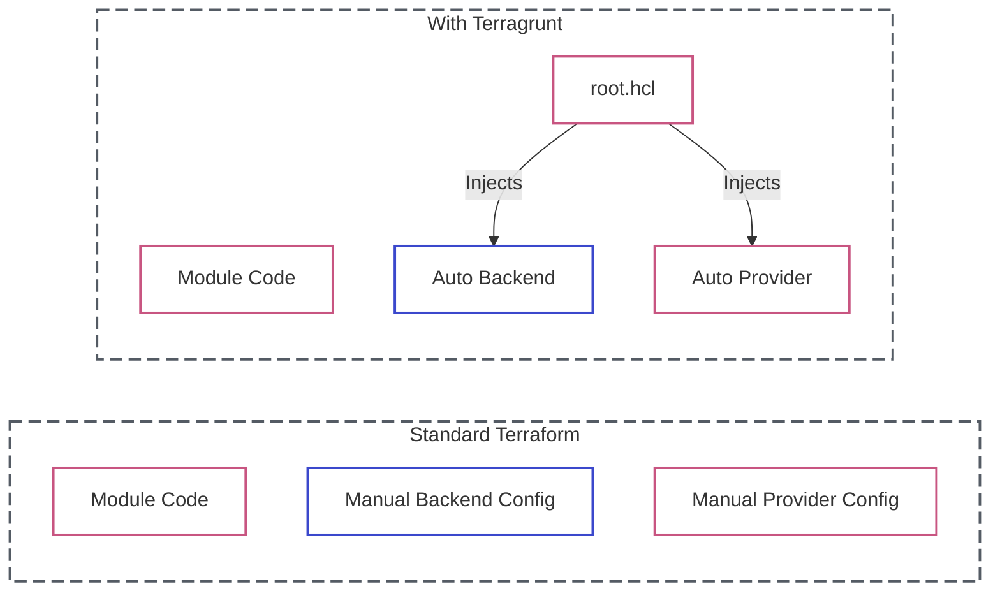

# Lab 11: Terragrunt Basics

| Difficulty | Est. Time | Prerequisites |
|------------|-----------|---------------|
| Intermediate| 60 Mins   | Lab 07, Lab 08|

## 🎯 Objectives
- Understand the **DRY (Don't Repeat Yourself)** principle for infrastructure.
- Use **Terragrunt** to wrap Terraform and automate configuration.
- Centralize **Remote State** and **Provider** settings in a single file.
- Master the `root.hcl` configuration.

---

## 🗺️ Terragrunt vs Terraform



---

## 📚 Concepts

### 1. What is Terragrunt?
Terragrunt is a thin wrapper that provides extra tools for keeping your configurations DRY, working with multiple Terraform modules, and managing remote state. 

### 2. The DRY Problem
As you scale, you often find yourself copy-pasting the same `terraform { backend "s3" {...} }` block into dozens of modules. If the bucket changes, you have to update every single file. Terragrunt solves this by allowing you to define the backend **once** at the root of your project.

### 3. Key Features
- **Remote State Management**: Automatically creates S3 buckets and DynamoDB tables.
- **Provider Injection**: Generates `provider.tf` files for you.
- **Dependency Management**: Easily pass outputs between modules without hard-coding IDs.

---

## 🛠️ Step-by-Step Lab

### Step 1: Install Terragrunt
If not already installed in your environment, you can download the binary from the [official releases](https://github.com/gruntwork-io/terragrunt/releases).
```bash
terragrunt --version
```

### Step 2: The Project Structure
Setup your directory so we can use a root config:
```text
.
├── root.hcl                # Root configuration (State & Providers)
└── infra/
    └── vpc/
        └── terragrunt.hcl  # Child configuration (Module call)
```

### Step 3: Configure the Root (DRY State)
Create the root `root.hcl`:
```hcl
remote_state {
  backend = "s3"
  generate = {
    path      = "backend.tf"
    if_exists = "overwrite_terragrunt"
  }
  config = {
    bucket         = "my-unique-bucket-name"
    key            = "${path_relative_to_include()}/terraform.tfstate"
    region         = "us-east-1"
    encrypt        = true
    dynamodb_table = "my-lock-table"
  }
}
```

### Step 4: Call a Module
In `infra/vpc/terragrunt.hcl`, inherit the root and point to a module:
```hcl
include "root" {
  path = find_in_parent_folders("root.hcl")
}

terraform {
  source = "../../modules/vpc" # Points to your Lab 07 module
}

inputs = {
  vpc_cidr = "10.5.0.0/16"
}
```

### Step 5: Run Terragrunt
Navigate to `infra/vpc` and run:
```bash
terragrunt plan
terragrunt apply
```
**Observation**: Notice how Terragrunt automatically created the `backend.tf` and initialized the state in S3 without you writing any backend code in the module!

---

## ❓ Troubleshooting & Pitfalls

- **`find_in_parent_folders()`**: This function searches upwards for the specified file (usually `root.hcl`). If it fails, check your folder nesting.
- **Source Paths**: Be careful with relative paths in `source`. Always verify that the path to your Terraform modules is correct from the perspective of the child `terragrunt.hcl`.

---

## 🧠 Lab Tasks: The DRY Reformer
**Goal**: Consolidate provider and backend configuration.

1.  **Global Provider**: Define a `root.hcl` file that uses `generate "provider"` to inject a standard AWS provider with default tags (e.g., `Owner = "Intern"`) into all child modules.
2.  **Dynamic State**: Use `path_relative_to_include()` in your `remote_state` block to ensure that `dev/vpc` and `dev/s3` automatically get unique folders in your S3 bucket without hardcoding paths.
3.  **The Overview**: Execute `terragrunt run-all plan` from the `dev/` root directory.
4.  **Verification**: Provide the plan output showing that all resources are being created in their correct AZs and with the global "Intern" tag applied.

---

## 🧹 Cleanup
Run `terragrunt destroy`.
