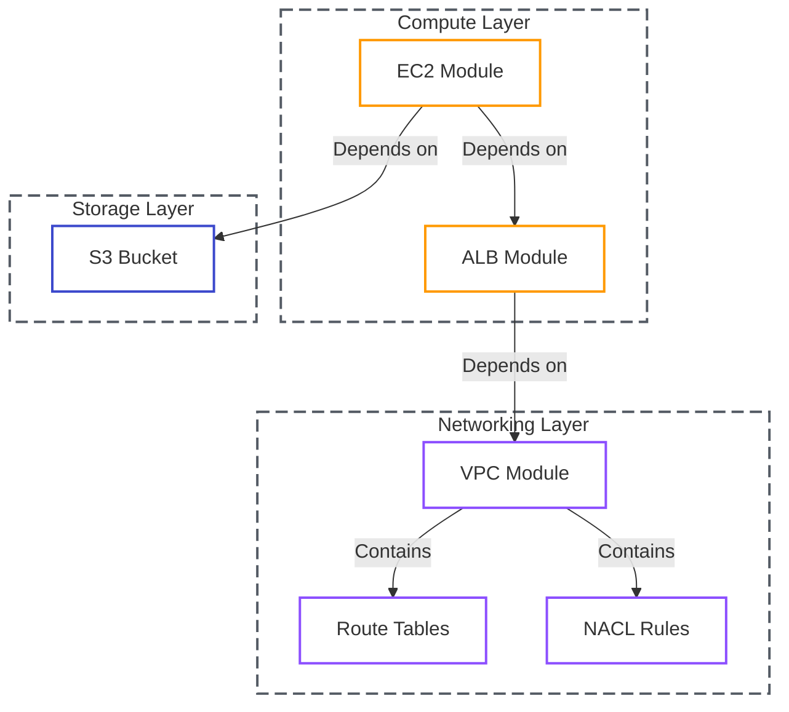

# Lab 12: Complex Terragrunt Stacks

| Difficulty | Est. Time | Prerequisites |
|------------|-----------|---------------|
| Advanced   | 90 Mins   | Lab 11 Completion |

## 🎯 Objectives
- Deploy a production-ready stack: **VPC**, **ALB**, **EC2**, and **S3**.
- Master Terragrunt **`dependency` blocks** to pass data between modules.
- Configure component-level networking with **Route Tables** and **NACLs**.
- Use `run-all` to manage the entire lifecycle of the stack.

---

## 🗺️ The Complex Stack Architecture



---

## 📚 Concepts

### 1. The Power of `dependency`
In standard Terraform, you often use `data "terraform_remote_state"` to read outputs from other stacks. This is "brittle" because it doesn't enforce execution order. Terragrunt's `dependency` block:
- **Enforces Order**: Terragrunt won't start the ALB until the VPC is finished.
- **Auto-Passes Outputs**: No more hardcoding VPC IDs or Subnet IDs.

### 2. Single Account "Environments"
Since we are in a single AWS account, we use folder separation (e.g., `infra/dev/`) and prefixing to keep resources organized without account-level boundaries.

---

## 🛠️ Step-by-Step Lab

### Step 1: Initialize the Directory Structure
Create a folder structure that allows for environment-level overrides while keeping everything DRY:
```text
infra/
├── root.hcl                # Global config (State/Providers)
├── modules/
│   ├── vpc/                # Manual VPC Module
│   └── alb/                # Manual ALB Module
├── dev/
│   ├── env.hcl             # { env = "dev" }
│   ├── vpc/
│   ├── alb/
│   └── app-server/         # New: Compute Layer
└── prod/
    ├── env.hcl             # { env = "prod" }
    ├── vpc/
    ├── alb/
    └── app-server/         # New: Compute Layer
```

### Step 2: Configure the Root (`root.hcl`)
Create the `root.hcl` at the base of your `infra/` directory. This file centralizes your remote state and provider generation:

```hcl
remote_state {
  backend = "s3"
  generate = {
    path      = "backend.tf"
    if_exists = "overwrite_terragrunt"
  }
  config = {
    bucket         = "my-unique-terragrunt-state-${get_aws_account_id()}"
    key            = "${path_relative_to_include()}/terraform.tfstate"
    region         = "us-east-1"
    encrypt        = true
    dynamodb_table = "my-lock-table"
  }
}

generate "provider" {
  path      = "provider.tf"
  if_exists = "overwrite_terragrunt"
  contents  = <<EOF
provider "aws" {
  region = "us-east-1"
  default_tags {
    tags = {
      ManagedBy = "Terragrunt"
      Project   = "Intern-Labs"
    }
  }
}
EOF
}
```

### Step 3: Environment Configuration (`env.hcl`)
In each environment folder (`dev/` and `prod/`), create an `env.hcl` file:
```hcl
# infra/dev/env.hcl
locals {
  env = "dev"
}
```
*(Repeat for `prod/` changing the value to `"prod"`)*.

### Step 4: Inherit and Prefix (VPC)
In both `dev/vpc/terragrunt.hcl` and `prod/vpc/terragrunt.hcl`, use inheritance to pull the environment name and use it as a prefix:

```hcl
include "root" {
  path = find_in_parent_folders("root.hcl")
}

locals {
  env_vars = read_terragrunt_config(find_in_parent_folders("env.hcl"))
  env      = local.env_vars.locals.env
}

terraform {
  source = "../../modules/vpc" # Points to your local module
}

inputs = {
  name = "${local.env}-complex-vpc" # Resource name will be dev-complex-vpc
  cidr = local.env == "dev" ? "10.0.0.0/16" : "10.1.0.0/16"
  
  azs             = ["us-east-1a", "us-east-1b"]
  public_subnets  = local.env == "dev" ? ["10.0.1.0/24"] : ["10.1.1.0/24"]
}
```

### Step 5: Configure the ALB with Target Groups
In `dev/alb/terragrunt.hcl`, we configure the ALB to route traffic to our future EC2 instances:

```hcl
include "root" {
  path = find_in_parent_folders("root.hcl")
}

dependency "vpc" {
  config_path = "../vpc"
}

locals {
  env_vars = read_terragrunt_config(find_in_parent_folders("env.hcl"))
  env      = local.env_vars.locals.env
}

terraform {
  source = "../../modules/alb"
}

inputs = {
  name    = "${local.env}-app-alb"
  vpc_id  = dependency.vpc.outputs.vpc_id
  subnets = dependency.vpc.outputs.public_subnets

  target_groups = [
    {
      name_prefix      = "h-"
      backend_protocol = "HTTP"
      backend_port     = 80
      target_type      = "instance"
    }
  ]

  http_tcp_listeners = [
    {
      port               = 80
      protocol           = "HTTP"
      target_group_index = 0
    }
  ]
}
```

### Step 6: Deploy the EC2 with HTTP Service
In `dev/app-server/terragrunt.hcl`, we deploy the EC2 instance and attach it to the ALB:

```hcl
include "root" {
  path = find_in_parent_folders("root.hcl")
}

dependency "vpc" {
  config_path = "../vpc"
}

dependency "alb" {
  config_path = "../alb"
}

locals {
  env_vars = read_terragrunt_config(find_in_parent_folders("env.hcl"))
  env      = local.env_vars.locals.env
}

terraform {
  source = "../../modules/ec2"
}

inputs = {
  name           = "${local.env}-web-server"
  instance_type  = "t3.micro"
  subnet_id      = dependency.vpc.outputs.public_subnets[0]
  vpc_security_group_ids = [dependency.vpc.outputs.default_security_group_id]

  # Simple HTTP service via Python
  user_data = <<-EOF
              #!/bin/bash
              echo "Hello from ${local.env} environment!" > index.html
              nohup python3 -m http.server 80 &
              EOF

  # Attach to ALB Target Group
  target_group_arns = [dependency.alb.outputs.target_group_arns[0]]
}
```

### Step 7: Deploying at Scale
Terragrunt allows you to deploy specific environments or everything at once.

1.  **Specific Env**: Navigate to `infra/dev/` and run `terragrunt run-all plan`.
2.  **Global Stack**: Navigate to `infra/` and run `terragrunt run-all plan`.
3.  **Observation**: Watch the dependency graph. Terragrunt ensures the order: **VPC -> ALB -> App Server**.
4.  **Verification**: Once applied, copy the ALB DNS name and visit it in your browser. You should see "Hello from dev environment!".

---

## ❓ Troubleshooting & Pitfalls

- **Dependency Cycles**: If A depends on B and B depends on A, Terragrunt will throw an error. Keep your graph strictly top-down (Networking -> Storage -> Compute).
- **Missing Outputs**: If your module doesn't output a value, the `dependency` block can't read it. Ensure your modules have `outputs.tf` defined.

---

## 🧠 Lab Tasks: The Multi-Stage Orchestrator
**Goal**: Manage complex, cross-component dependencies.

1.  **Environment Toggling**: Setup `dev/` and `prod/` folders. Use an `env.hcl` file in each folder to automatically set the `instance_type` (e.g., `t3.micro` for dev, `t3.small` for prod).
2.  **Strict Dependencies**: Link your modules using `dependency` blocks: `VPC -> SG -> EC2`. Ensure the EC2 module waits for the Security Group to be created first.
3.  **The Master Command**: Navigate to the `dev/` root and run `terragrunt run-all apply`. 
4.  **Verification**: Provide the final "Apply complete!" summary logs showing that all 3 modules were deployed in the correct order.

---

## 🧹 Cleanup
Run `terragrunt run-all destroy`.
