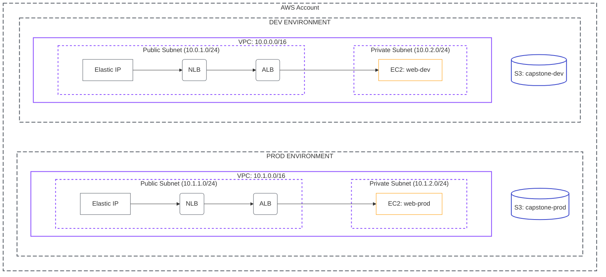

# Capstone Project: The Great Migration

## 🎯 Vision
You are a Cloud Engineer tasked with modernizing a legacy environment. A previous team built a multi-environment setup manually through the AWS Console. Your mission is to **discover** this infrastructure using automation, **codify** it into Terragrunt, and prove that you have achieved **Full Lifecycle Management**.

## 🗺️ Project Architecture
The project requires two distinct environments (Dev and Prod) within the same AWS account.



---

## 📋 Technical Specifications

### Phase 1: The Manual Build (Console)
You must build the following components manually. No automation is allowed in this phase.

#### 🛠️ Tools Needed
- **AWS Management Console**
- **Web Browser**

#### 📦 Deliverables
- **Live Infrastructure**: A fully functional Dev and Prod environment as defined below.
- **Connectivity Proof**: Screenshots of successful SSH access (or Session Manager) to the private EC2 instances from a bastion or temporary public instance.

#### 1. Networking (Per Environment)
| Resource | Dev Requirement | Prod Requirement |
| :--- | :--- | :--- |
| **VPC CIDR** | `10.0.0.0/16` | `10.1.0.0/16` |
| **Public Subnet** | `10.0.1.0/24` (AZ-a) | `10.1.1.0/24` (AZ-a) |
| **Private Subnet** | `10.0.2.0/24` (AZ-a) | `10.1.2.0/24` (AZ-a) |
| **Internet Gateway** | Attached to VPC | Attached to VPC |
| **NAT Gateway** | Placed in Public Subnet | Placed in Public Subnet |
| **Route Tables** | Public routes to IGW; Private to NATGW | Public routes to IGW; Private to NATGW |

#### 2. Compute, Load Balancing & Storage
- **EC2 Instances**: 
    - Type: `t3.micro` (Amazon Linux 2023).
    - Placement: **Private Subnet**.
    - Security Group: Allow HTTP (80) from ALB Security Group only.
- **ALB (Application Load Balancer)**:
    - Type: Internet-facing (placed in Public Subnets).
    - Listeners: HTTP (80) forwarding to Target Group (EC2).
- **NLB (Network Load Balancer)**:
    - Type: Internet-facing.
    - Static IPs: Assign **Elastic IPs** to each subnet mapping.
    - Listeners: TCP (80) forwarding to Target Group (**ALB as Target**).
- **S3 Buckets**:
    - Naming: `capstone-[env]-[your-name]-[random-suffix]`.
    - Encryption: AES-256 enabled.

---

### Phase 2: The Discovery (SDK/CLI)
Before you can import, you must identify your targets. You are required to use automation to find and record resource attributes.

#### 🛠️ Tools Needed
- **AWS CLI**
- **AWS SDK** (Boto3/Python, Node.js, or Go)
- **JSON Parser** (e.g., `jq`)

#### 📦 Deliverables
- **`discovery.json`**: A structured file containing all Resource IDs and metadata mapped to their environment and type.
- **Audit Script**: The code (Python/Bash) used to query the resources.

#### Discovery Requirements
You must retrieve the following for every resource created:

1.  **VPC IDs** and their associated **Route Table IDs**.
2.  **Subnet IDs** (mapped to their types).
3.  **Instance IDs** and their **Private IP addresses**.
4.  **ALB & NLB ARNs** and their associated **DNS Names**.
5.  **Target Group ARNs** and health check settings.
6.  **Bucket Names** and their exact **ARN**.

*Requirement: Save this data in a `discovery.json` file for your own reference during the migration.*

---

### Phase 3: The Migration (Terragrunt)
Your goal is to bring the resources under Terragrunt management without triggering a "Replacement" (Destroy/Create).

#### 🛠️ Tools Needed
- **Terragrunt** (v0.50+)
- **Terraform** (v1.5+)
- **Git**

#### 📦 Deliverables
- **`terragrunt.hcl` Files**: A complete, DRY repository structure.
- **Success Logs**: Output of `terragrunt run-all plan` showing "No changes" across all environments.

#### Target Structure
Your repository must follow this DRY structure:
```text
infrastructure/
├── terragrunt.hcl (Root)
├── dev/
│   ├── vpc/
│   ├── alb/
│   ├── nlb/
│   ├── ec2/
│   └── s3/
└── prod/
    ├── vpc/
    ├── alb/
    ├── nlb/
    ├── ec2/
    └── s3/
```

#### The Success Criteria
A successful migration is achieved when:
1.  `terragrunt run-all plan` returns **No changes** (initial state match).
2.  The state is stored in an S3 backend (automatically managed by the root config).
3.  Resources are addressed logically (e.g., `module.vpc.aws_vpc.this`).

---

### Phase 4: Lifecycle Management (Modification)
To prove you are in control, perform the following modifications via Terragrunt.

#### 🛠️ Tools Needed
- **Terragrunt**
- **AWS Management Console** (for verification)

#### 📦 Deliverables
- **Updated State**: Evidence of new tags and configuration changes in the AWS Console.
- **Deployment Logs**: Clean `apply` logs showing only the expected modifications.

#### The Challenge
Perform the following modifications:

1.  **Tagging Policy**: Add a `MigrationDate` and `Owner` tag to ALL resources.
2.  **Security Hardening**: Modify the EC2 Security Group to allow ICMP (Ping) from your workstation's IP.
3.  **S3 Update**: Enable **Versioning** on both S3 buckets.

**Validation**: Run `terragrunt run-all apply`. Check the AWS Console to confirm that these changes were applied successfully without recreating the resources.

---

## 🧹 Cleanup
Once the project is verified, use `terragrunt run-all destroy`.
*Note: Any manually created resources not imported into Terragrunt must be deleted manually.*
